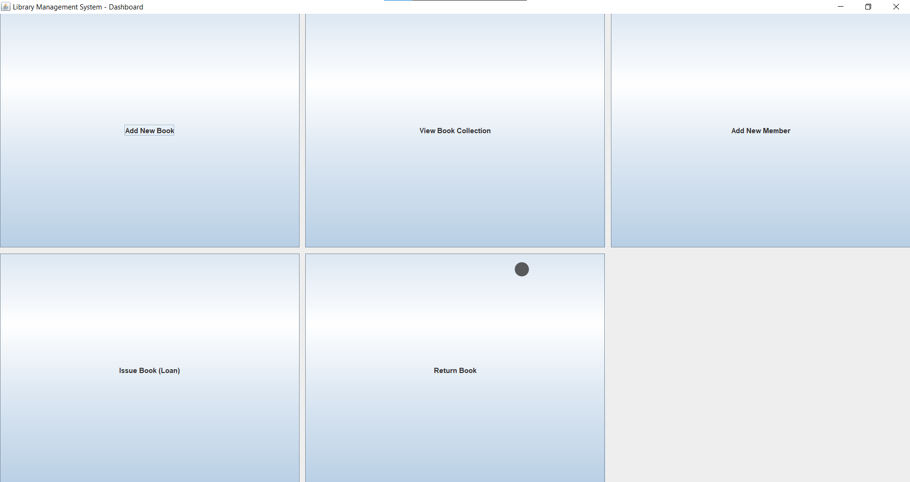

# Technical Specification: Library Management System

## 1. Project Overview
This Capstone Project is a robust Java Desktop Application designed to manage library operations. It features a tiered architecture and integrates a relational database to handle complex borrowing/returning logic.

## 2. System Architecture (MVC)
The application is built using the **Model-View-Controller** design pattern:
* **Model**: `Book.java` and `Member.java` define the data structures.
* **View**: Swing-based JFrames handle user interaction and data input.
* **Controller/Data Layer**: `DatabaseHandler.java` manages JDBC connections and SQL execution.

## 3. Database Schema Design
We utilized **SQLite** for data persistence. The relational schema is defined as follows:

| Table | Primary Key | Foreign Keys | Key Attributes |
| :--- | :--- | :--- | :--- |
| **books** | id (INT) | None | title, author, isbn, isAvailable |
| **members** | id (INT) | None | name, email |
| **issue_records** | id (INT) | book_id, member_id | issue_date, due_date |

## 4. Key Technical Implementations
### A. ACID Compliance & Transactions
To ensure data integrity, the **Issue Book** and **Return Book** functionalities use SQL transactions. By setting `setAutoCommit(false)`, the system ensures that the `books` table status and `issue_records` table are updated simultaneously or not at all.

### B. JDBC Integration
The system uses the `sqlite-jdbc` driver to bridge the Java application with the `.db` file, supporting full CRUD (Create, Read, Update, Delete) operations.

## 5. Testing & Validation
* **CRUD Testing**: Verified that books and members are correctly persisted.
* **Logic Testing**: Confirmed that a book's availability status toggles correctly upon loan and return.
* **Error Handling**: Implemented `try-with-resources` to prevent memory leaks and handle SQL exceptions gracefully.

## 6. Application Preview (Output)

### Main Dashboard
The central hub of the application providing access to all modules.

### Inventory Management
Displays the real-time status of books fetched from the SQLite database.

